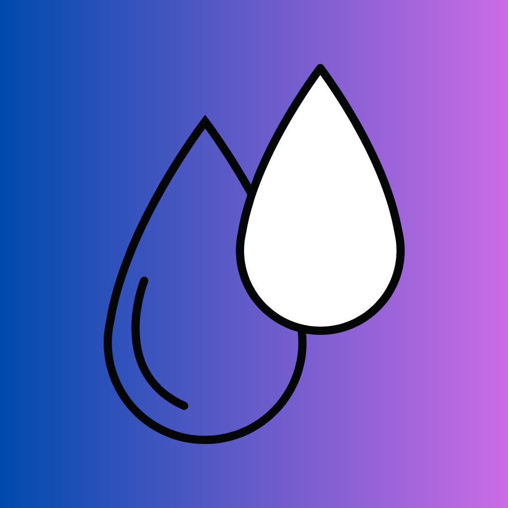
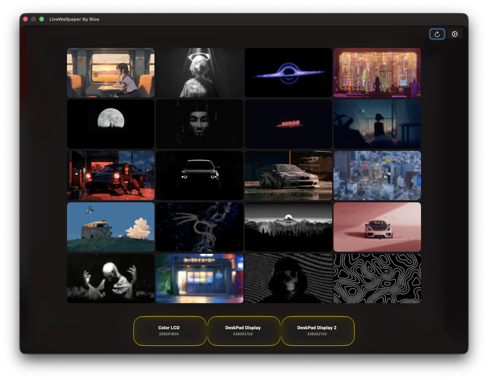
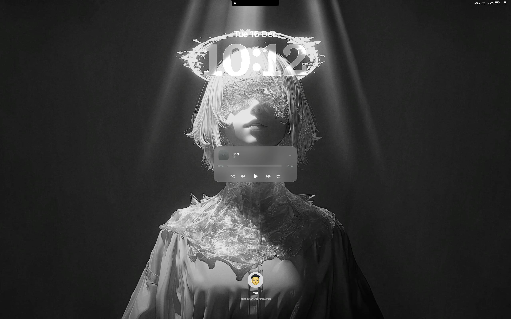
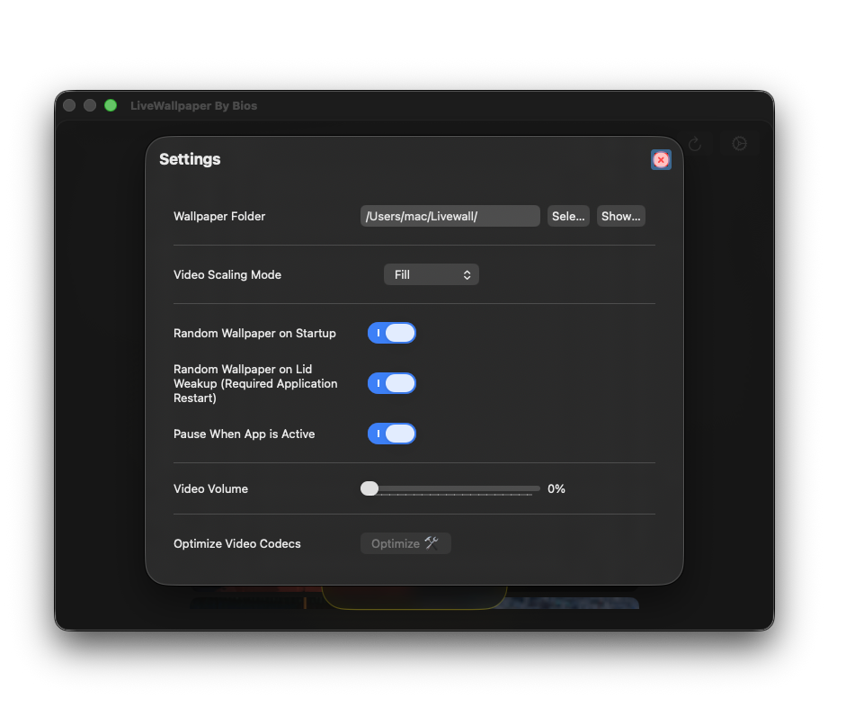
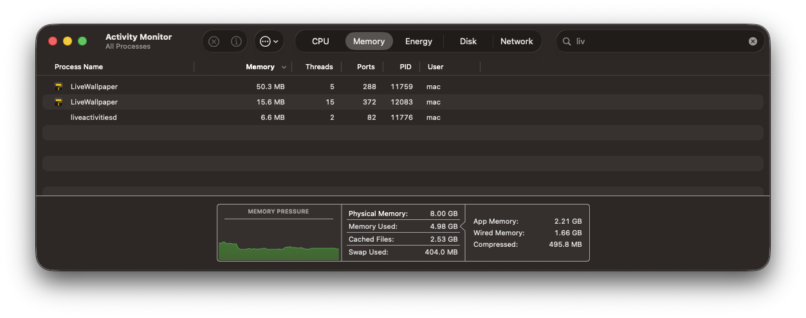
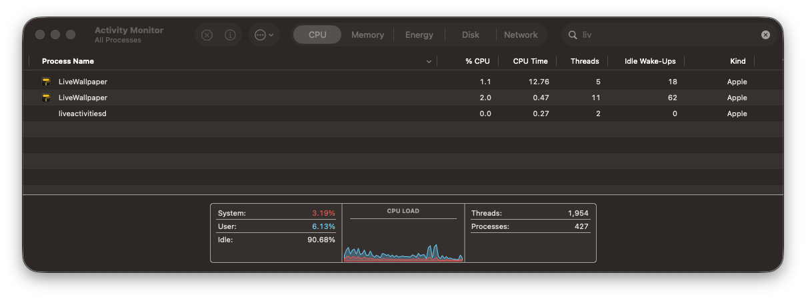
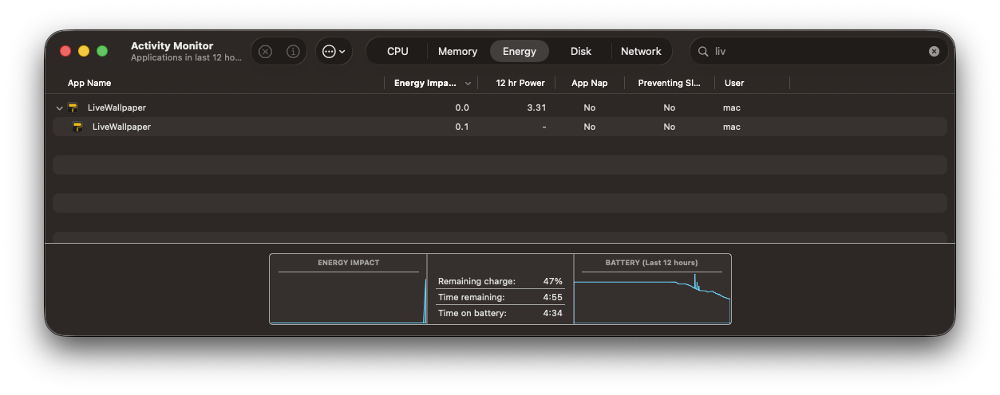

> [!NOTE]
> ## 我将把 Objective C++ 的 UI 逐步改造成 SwiftUI，但 `daemon` 不会改变。

# macOS 14+ 动态壁纸应用 LiveWallpaper

**语言：** [English](README.md) | 简体中文

这是一个面向 macOS 14+ 的开源动态壁纸应用。

## 使用 Homebrew 安装

在终端运行：`brew tap thusvill/livewallpaper && brew install --cask livewallpaper`

## 从源码编译安装

- macOS 14+
- git
- Xcode
- CMake

运行：
`git clone https://github.com/thusvill/LiveWallpaperMacOS.git && cd LiveWallpaperMacOS && mkdir -p build && cd build && cmake .. && make -j$(sysctl -n hw.ncpu)`

## DMG 安装指南

> [!IMPORTANT]
> ## 修复 “LiveWallpaper.app” 已损坏，无法打开。建议你将该对象移到废纸篓。
> 将应用安装到 Applications 文件夹后，你需要绕过 Gatekeeper 才能运行（因为我不想为开源应用给 Apple 付费）。
>
> 这也会解决占用问题：
>
> `xattr -cr /Applications/LiveWallpaper.app`
>
> 注意：必须使用**递归**删除（`-cr`）。仅执行 `xattr -d com.apple.quarantine /Applications/LiveWallpaper.app` 只会移除应用包根目录的隔离属性，应用内部仍有被隔离的文件，macOS 会继续提示应用已损坏。

点击 “OpenInFinder” 按钮会打开一个文件夹，你可以把壁纸文件放进去。

> [!NOTE]
> 文件名中不要包含多个点号（扩展名的点号除外）！
>
> ## 例如：
>
> - file.1920x1080.mp4 ❌（点号数量 > 1）
> - file-1920x1080.mp4 ✅（点号数量 = 1）

> [!NOTE]
> 目前支持 `.mp4` 和 `.mov`

> https://github.com/user-attachments/assets/3d82e07d-b6b9-4a7d-b6de-5dd05dff3128

## 图库

> 

> ## 这是静态图片，目前 LiveWallpaper 不支持锁屏播放视频。
> 

> 

> https://github.com/user-attachments/assets/36fb169e-b7cc-4489-9459-dab07c8dd2c6

> # 性能
> 
> 
> 
> # 多显示器支持

> https://github.com/user-attachments/assets/9575873c-79e6-4eba-a7a5-9408b2cc4ed0

<!--
## 图库
> 
> 

> 

> 

> 

> https://github.com/user-attachments/assets/748c7078-1f99-4182-876f-08aa59d2bc63
-->

许可协议请参见 [LICENSE](LICENSE)。
